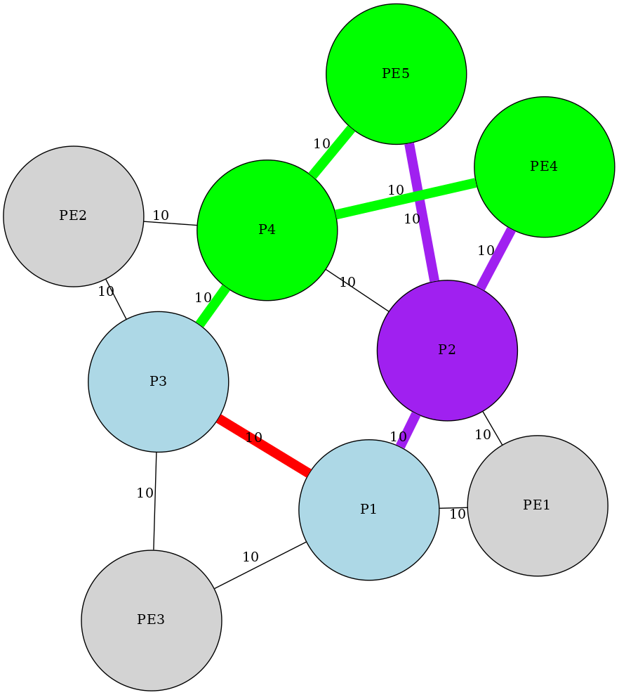

# pyFastReRoute

## Contents

* [What is it?](what-is-it)
* [Requirements](requirements)
* [How do I use it?](how-do-i-use-it)
* [Documentation](documentation)
* [Limitations](limitations)

### What is it?

A python3 module that...

* Accepts a network topology data as input and greate a network graph

* Calculates various paths types (SPF/LFA/rLFA)/TI-LFA) between nodes in the network graph

* Outputs the calculated paths in various formats (rendered diagrams, as a JSON blob, a Python dict)


### Requirements

```bash
# Must have to use this module:
pip3 install networkx pydot

# Optional to render paths as diagrams:
sudo apt-get install graphviz

# Optional to use the provided example script:
pip3 install argparse
```

### How do I use it?

To get you started quickly, there is an example script which demonstrates various features.

Optionally one can install the module and its prerequisites in a virtual environment:

```bash
~$ cd /tmp
/tmp$ git clone https://github.com/jwbensley/ip-frr.git
/tmp$ cd ip-frr
/tmp/ip-frr$ virtualenv ip-frr
/tmp/ip-frr$ source ip-frr/bin/activate
(ip-frr) /tmp/ip-frr$ pip3 install networkx pydot
(ip-frr) /tmp/ip-frr$ sudo apt-get install graphviz
```

Then simply run the example script which will load an example topology, generate all rLFA paths and then generate diagrams of them all:
```bash
(ip-frr) /tmp/ip-frr$ ./example/example.py --topology example/mesh_topo.json --type json --rlfa --diagram
Rendered rLFA path diagrams to ./diagrams/mesh_topo/2021-05-13--07-34-29-845195
```

Below is one of the example rendered diagrams. P1 and P3 are the source and destination nodes respectively. The purple path shows the remote loop-frr alternative path, protecting the failed shortest path highlighted in red (the link directly between P1 and P3). P1 has two ECMP rLFA paths via two remote nodes (PE4 and PE4) which gaurantees not to use the failed P1->P3 link to reach P3. The green paths show the default shortest paths from PE4 and PE5 to P3 which are unnafected by the P1->P3 link failure.

[](./example/P1_P3_rlfas_link.png)

### Documentation

[pyFRR.md](docs/pyFRR.md) provides documentation for the module overall.

Specific documentation is provided for each feature:

* [LFA.md](docs/LFA.md) provides documentation for the RFC5286 Loop-Free Alternate features
* [rFLA.md](docs/rLFA.md) provides documentation for the RFC7490 Remote Loop-Free Alternate  features
* [TI-LFA.md](docs/TI-LFA.md) provides documentation for the draft-ietf-rtgwg-segment-routing-ti-lfa-06 Topology Independent Fast Reroute using Segment Routing features


### Planned Features

* All distances arecurrently calculated as weighted paths, rather than simple paths (hop count). Add support for a simple hop count as a metric (e.g., DC-fabrics).

* Add support for Shared Risk Link Groups.

* Add option to show next best alternate paths


### Limitations

* Only single order failures are computed. Alternate paths aren't calculated to support multiple simultaneous failures.

* It is assumed that all nodes in the topology graph are "relevant" (i.e., they are participating in making forwarding decisions and forwarding traffic, and that none are transparent devics such as layer 2 switches).

* It is assumed that all links are in scope i.e., none have the IS-IS attribute "link excluded from local protection path" or "local maintenance required" set.

* It is assumed that the topology is in a normal operating state for example, that no links or nodes have recently flapped and the IS-IS overload-bit or OSPF LSInfinity is set.

* Link/edge weights are assumed to be bidirectional, asymetrical paths aren't supported (in NetworkX terminology: `g.is_directed() == False`, `g.is_multigraph() == False`)

* Un-Equal Cost Multipath Routing is not supported, but ECMP is supported.


### References

It's hard to find good references on these technologies.

Authoritative References:

* Inequality 2 is given directly after Inequality 1 with no mention of when to use it or why: https://tools.ietf.org/rfc/rfc5286.txt

Vendor and Blog Posts:

* This one is tricky to follow, the difference between Inequality 1/2/3 and when to use each isn't clear: https://packetpushers.net/ip-frr-micro-loops-part-1/

* This Cisco article has lost it's formatting and there are gramatical mistakes which jointly make it difficult to follow: https://www.cisco.com/c/en/us/support/docs/multiprotocol-label-switching-mpls/ldp/212697-loop-free-alternate-and-remote-loop-free.html

* This is clear but it only explains the concepts of P and Q space: https://packetpushers.net/mind-your-qs-and-ps/

* This doesn't explain LFA Inequality 2 and explains Inequality 3 but calls it "2", and it doesn't clearly show the difference between P Space and Extended P Space because Huawei use EP-Space by default: https://support.huawei.com/enterprise/en/doc/EDOC1100170495
